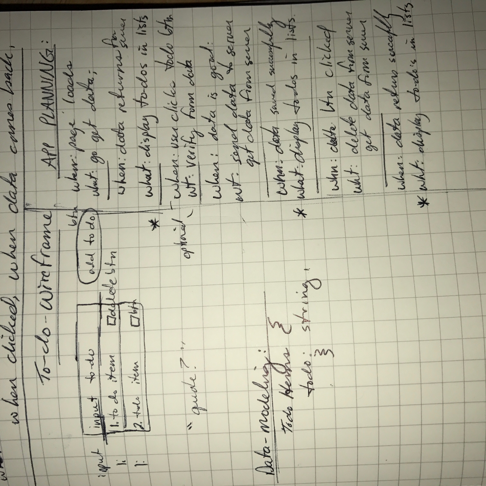

# Day 17: ToDo List
* Create a simple to do List

## Learning Objectives:
* using json to interface with a REST api server
* [My Tiny Za Server](http://tiny-za-server.herokuapp.com/collections/joebum)
* Use ajax: GET, POST, DELETE to the server
* Display data on the DOM
* Use App Planning for the first time including wire-frame, data modeling, and app planning (see attached image below)

## Future Processes
* Need to fix a few bugs:
  * add the delete function to the returned ajax data so it deletes when the data has actually been deleted from the server.
  * the elements added to the DOM are not being deleted from the server.

## Explorer Mode

* Create a simple ToDo list application using HTML, Sass, JavaScript and the jQuery library.
* Your app should at a minimum include a text field for the user to create new ToDos, and a list of already created ToDos for the user to see, and a button for each item on the list to delete it.
* When the user enters a new ToDo, it should save to tiny-pizza-server.
* When the page loads, your app should GET all the todos stored on the server and display them in the list.
* When the user clicks the delete button next to an item, it should delete that item from the server

### NOTES
* Before you begin coding, sketch out your application. Include your designs in your repo.

* Before you begin coding, write notes about WHAT happens, WHEN.
* Before you begin coding, do some data modeling!

#### App Work Flow, wire frames, and data modeling

### WHAT TO SUBMIT

* A link to a repository containing at least:
  * index.html
  * main.js
  * styles/main.scss
  * a README showing your application sketches, data modeling, and notes about WHAT happens WHEN

  * In the Notes section, include a link to your project live on the internet
  * As always, in the Notes section, include your confidence (1-5) and if you are anything below 5, briefly explain why.

## Adventurer Mode

* In addition to deleting items, allow a user to complete and un-complete them! Make sure they stay either complete or not completed on the server when the user changes their status.
